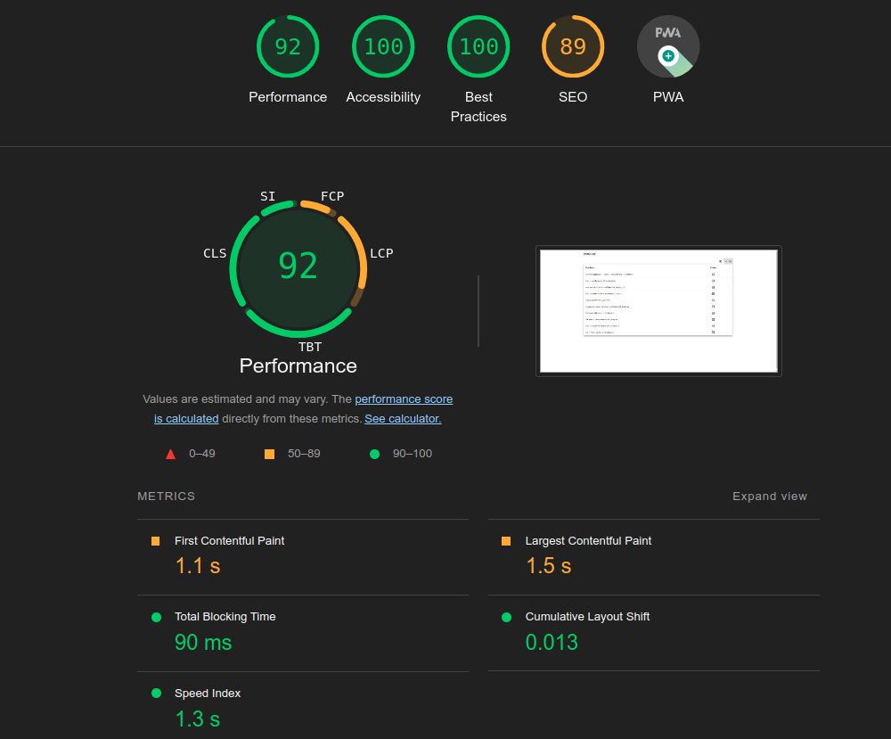

# PEC 5
## Ejercicio 1
- Api unsplash
- Se utiliza un ItemRawDTO con la respuesta del api y un ItemDTO simplificado con los datos que necesitamos que se transforma directamente en el ItemService.
- Se crea servicio LoadingService para controlar la carga de datos de los servicios.
- Se crea animación en la carga de el listado de items.
- Actualización a versión 17 de Angular desde la versión 15
  - ng update @angular/core@16 @angular/cli@16
  - ng update @angular/core@17 @angular/cli@17
  - Comando npm outdated muestra la relación de versiones desactualizadas del proyecto
  - Para poder utilizar la extensión @angular/pwa sin conflictos con siguiente [vídeo](https://www.youtube.com/watch?v=i7dAzpXEEeY) y la [documentación oficial](https://angular.dev/update-guide).
- Actualización a la versión 17 de Angular material desde la versión 15
  - ng update @angular/material@16 @angular/cdk@16
  - ng update @angular/material@17 @angular/cdk@17
- Se modifica archivo manifest.webmanifest para eliminar algunos errores y advertencias.
  - Eliminamos purpose de los iconos
  - Añadimos sección screenshots con imágenes para escritorio y móvil.
- Se realiza informe Lighthouse
  - El diagnóstico indica mejoras en la compresión de texto, imágenes demasiado grandes, reducción de javascript sin uso, minimizar javascript y se podría mejorar el SEO de la página. Se puede ver parte del resultado en la imagen siguiente:

- El serviceworker se ha configurado con una preferencia sobre contenido actualizado antes de utilizar la cache. Se almacenan un máximo de 10 elementos que es el número de elementos de la respuesta de la lista de imagenes. Y se ha puesto una duración de 1h de tiempo para refrescar y 1 segundo para la respuesta del servidor remoto. Es una configuración básica siguiendo el ejemplo de la práctica.

## Ejercicio 2

  [Aplicación PWA PEC5 desplegada en Netlify](https://des-front-adv-pec5.netlify.app/)
  - https://des-front-adv-pec5.netlify.app/